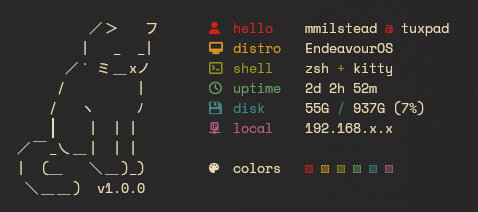

# purrfetch
Another system info tool written in Bash, but this time with a sleepy cat



## Installation

1. Create local bin directory and add to path:
```bash
mkdir -p ~/.local/bin
echo 'export PATH="$HOME/.local/bin:$PATH"' >> ~/.bashrc   # or ~/.zshrc for zsh
```

2. Download and set up script:
```bash
curl -o ~/.local/bin/purrfetch https://raw.githubusercontent.com/508LoopDetected/purrfetch/main/purrfetch
chmod +x ~/.local/bin/purrfetch
source ~/.bashrc   # or source ~/.zshrc for zsh
```

3. Run it with `purrfetch`

## Dependencies
- `curl` for public IP detection
- A terminal that supports Unicode and ANSI colors
- Nerd Font for icons

## Features
- Sleepy kitty
- Color-coded output
- System info display:
  - User @ hostname
  - Linux distribution
  - Shell + terminal
  - System uptime
  - Disk usage
  - Local and public IPs
